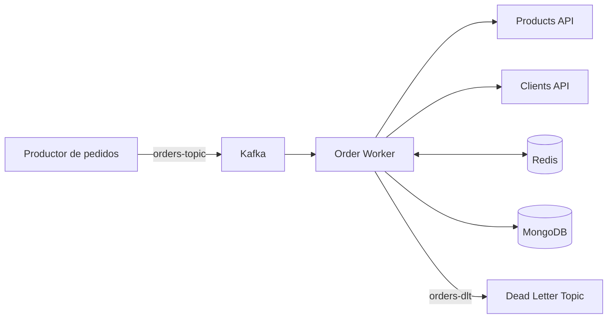

# B2B Order Processing

Procesador de pedidos B2B orientado a eventos. Recibe pedidos desde Kafka, consulta los catálogos de productos y clientes, calcula impuestos, evita procesar duplicados y guarda el resultado en MongoDB.

## Arquitectura



| Servicio | Tecnología | Puerto |
| --- | --- | --- |
| `products-api` | Go 1.21 | 8081 |
| `clients-api` | NestJS 11 | 8082 |
| `order-worker` | Java 21, Spring Boot 3.2 y WebFlux | 8080 |
| Kafka | Confluent Platform 7.7 | 9092 |
| MongoDB | MongoDB 7 | 27017 |
| Redis | Redis 7 | 6379 |

El worker conserva la separación entre dominio, aplicación e infraestructura. Las reglas de impuestos y los casos de uso no dependen de Kafka, MongoDB, Redis ni de los clientes HTTP.

## Flujo de procesamiento

1. El productor publica un pedido en `orders-topic`.
2. El worker valida `orderId`, `clientId` e `items`.
3. MongoDB indica si el pedido ya existe con estado `PROCESSED`.
4. Para un pedido nuevo, el worker obtiene cliente y productos en paralelo.
5. Redis evita repetir consultas mientras los datos estén dentro de su TTL.
6. Se calculan subtotales e impuestos con `BigDecimal`.
7. El resultado se guarda en la colección `enriched-orders`.
8. El offset de Kafka se confirma después de guardar el pedido.

Los errores transitorios se reintentan. Si el procesamiento agota los intentos, el mensaje original pasa a `orders-dlt` con tópico, partición, offset, fecha, causa y número de intento. El offset también se confirma después de publicar correctamente en DLT; si esa publicación falla, el mensaje de entrada queda pendiente.

## Ejecución local

Se necesita Docker Desktop con Docker Compose.

```powershell
Copy-Item .env.example .env
docker compose up --build -d
docker compose ps
```

En el primer arranque se construyen las tres aplicaciones, se crean `orders-topic` y `orders-dlt`, y el worker espera a que las dependencias estén listas.

Comprobaciones rápidas:

```powershell
Invoke-RestMethod http://localhost:8081/health
Invoke-RestMethod http://localhost:8082/health
Invoke-RestMethod http://localhost:8080/actuator/health
```

Para detener los servicios sin eliminar los datos:

```powershell
docker compose down
```

`docker compose down -v` también elimina los pedidos, la caché y los datos locales de Kafka.

## Publicar un pedido

El repositorio incluye un pedido en `examples/order.json` y un productor para PowerShell:

```powershell
.\scripts\publish-order.ps1
```

También se puede indicar otro archivo o tópico:

```powershell
.\scripts\publish-order.ps1 -File .\examples\order.json -Topic orders-topic
```

El ejemplo genera:

- subtotal: `182400.00`
- impuesto total: `20880.00`
- total: `203280.00 COP`

Consultar el resultado en MongoDB:

```powershell
docker compose exec mongodb mongosh orders --quiet --eval 'db.getCollection("enriched-orders").find().pretty()'
```

Si se vuelve a publicar el mismo `orderId`, el worker confirma el mensaje sin crear otro procesamiento.

Consultar mensajes fallidos:

```powershell
docker compose exec kafka kafka-console-consumer `
  --bootstrap-server kafka:29092 `
  --topic orders-dlt `
  --from-beginning
```

## APIs de catálogo

Productos:

```powershell
Invoke-RestMethod http://localhost:8081/products/PRD-001
```

Clientes:

```powershell
Invoke-RestMethod http://localhost:8082/clients/CLI-99821
```

Los identificadores inexistentes responden con HTTP 404. El worker no reintenta esos casos; los errores de servidor y de conectividad sí pasan por Retry y Circuit Breaker.

## Pruebas

Products API:

```powershell
cd products-api
go test ./...
```

Clients API:

```powershell
cd clients-api
npm ci
npm test
npm run test:e2e
```

Order Worker, pruebas unitarias y cobertura mínima del 70%:

```powershell
cd order-worker
.\mvnw.cmd verify
```

Flujo E2E con Kafka, MongoDB y Redis reales en Testcontainers:

```powershell
cd order-worker
.\mvnw.cmd -Pe2e verify
```

El E2E publica un pedido en Kafka, deja que el worker lo enriquezca y comprueba el documento resultante en MongoDB. Requiere que Docker esté ejecutándose.

## CI y checklist de revisión

El repositorio incluye un workflow en `.github/workflows/ci.yml` para validar cada push y pull request:

- `products-api`: `go test ./...`
- `clients-api`: instalación limpia, pruebas unitarias, build y e2e
- `order-worker`: `mvn verify` con cobertura

El E2E del worker con Testcontainers queda como ejecución manual en GitHub Actions para no hacer cada revisión innecesariamente pesada.

También hay una guía corta con comandos locales en `docs/validation-checklist.md`.

## Configuración

Las variables disponibles están documentadas en `.env.example`. Las principales son:

| Variable | Valor predeterminado | Uso |
| --- | --- | --- |
| `KAFKA_BOOTSTRAP_SERVERS` | `kafka:29092` | Brokers usados por el worker |
| `KAFKA_CONSUMER_GROUP` | `order-worker` | Grupo del consumidor |
| `KAFKA_ORDERS_TOPIC` | `orders-topic` | Tópico de entrada |
| `KAFKA_DLT_TOPIC` | `orders-dlt` | Tópico de errores |
| `KAFKA_PROCESSING_MAX_ATTEMPTS` | `3` | Intentos antes de DLT |
| `MONGODB_URI` | `mongodb://mongodb:27017/orders` | Base de pedidos |
| `PRODUCT_CACHE_TTL` | `300s` | TTL de productos |
| `CLIENT_CACHE_TTL` | `300s` | TTL de clientes |
| `PRODUCTS_API_URL` | `http://products-api:8081` | Catálogo de productos |
| `CLIENTS_API_URL` | `http://clients-api:8082` | Catálogo de clientes |
| `API_RESPONSE_TIMEOUT` | `3s` | Tiempo máximo de respuesta |

No hay URLs ni credenciales fijas dentro del código Java. Docker Compose proporciona valores locales y cualquier entorno puede reemplazarlos.

## Decisiones técnicas

- Reactor Kafka mantiene el consumo y la confirmación de offsets dentro del flujo reactivo.
- `concatMap` procesa cada partición de manera ordenada y evita carreras locales sobre el mismo pedido.
- MongoDB usa `orderId` como identificador del documento y consulta el estado `PROCESSED` antes de enriquecer.
- Redis tiene TTL independiente para productos y clientes.
- Los productos repetidos en un pedido se consultan una sola vez.
- Los errores 404 no activan Retry ni Circuit Breaker porque representan datos inexistentes, no una falla transitoria.
- Los cálculos monetarios usan `BigDecimal` y redondeo a dos decimales.
- El perfil Maven `e2e` separa Testcontainers de la compilación normal de la imagen.
